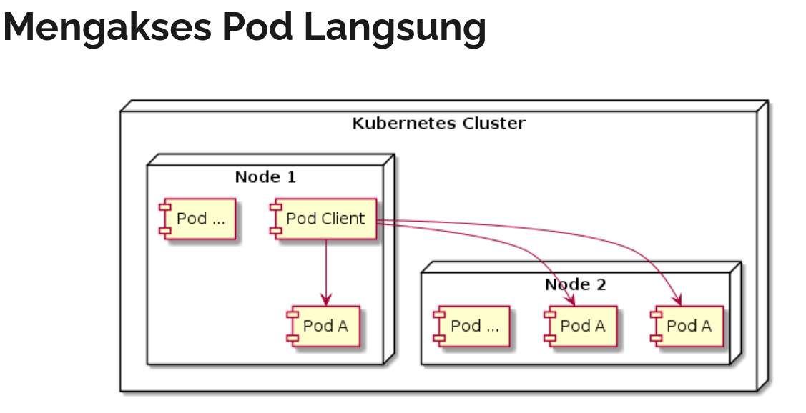

# service

service adalah resource di kubernetes yang digunakan untuk membuat satu gerbang untuk mengakses satu atau lebih pod.

service memiliki IP address dan port yang tidak pernah berubah selama service itu ada.

client bisa mengakses service tersebut, dan secara otomatis akan meneruskan ke pod yang ada dibelakang service tersebut. dengan begini client tidak perlu tahu lokasi tiap pod, ,dan pod bisa bertambah, berkurang,  atau berpindah, tanpa harus mengganggu client

